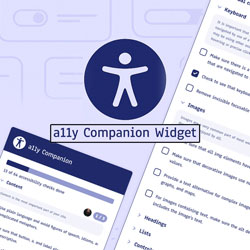

# ♿️ A11Y Companion – Accessibility Checklist Widget for Figma Design

A modern, open-source Figma widget that brings the [A11Y Project Checklist](https://www.a11yproject.com/checklist/) directly into your design workflow. Use this widget to check your designs, content, and code for accessibility and WCAG compliance, collaboratively with your team.

[a11y Companion Widget | Figma Community](https://www.figma.com/community/widget/1509302611418259130)

## ❓ What is this?

**A11Y Companion** is a Figma widget that helps you:

- Review and check off accessibility requirements for your project
- Track progress on WCAG compliance
- Collaborate with your team using avatars and real-time updates
- Get actionable, section-based checklist items with clear explanations and WCAG references

Based on the authoritative [A11Y Project Checklist](https://www.a11yproject.com/checklist/), this widget is designed for designers, content creators, and developers who want to make their work more accessible.

## ✨ Features

- Full A11Y Project checklist, organized by section
- Each item includes a WCAG reference and a detailed explanation
- Collapsible sections for easy navigation
- Progress tracking per section and overall
- Accessible custom checkboxes
- Tooltips with WCAG and long descriptions
- Property menu toggle to enable/disable tooltips

---

**Note:** Collaborative avatars (facepile) for team check-offs were removed in v1.1.0 for a simpler interface and less UI noise, based on overwhelming user feedback. Avatars could be reset by resetting widget state. This feature may return in the future with a toggle to enable or disable it.

- Modern, accessible UI with dark mode support coming in v1.2.0

## ▶️ How to Use

1. **Install the widget** in your Figma or FigJam file.
2. Open the widget and review the checklist items by section.
3. Check off items as you complete them; your team can see your progress in real time.
4. Hover over checklist items for WCAG references and detailed explanations.
5. Use the property menu to toggle tooltips on or off.

## 🤔 Why use this widget?

- Ensure your designs and content meet accessibility standards
- Make accessibility a collaborative, visible part of your workflow
- Reference the latest, community-driven accessibility guidance

## 🙌 Credits

- Checklist data and guidance from [The A11Y Project](https://www.a11yproject.com/checklist/)
- Widget built with the [Figma Widget API](https://www.figma.com/widget-docs/api/api-reference/)

## 🚀 Make Accessibility First-Class

**Make accessibility a first-class part of your design and development process!**

## 📝 License

This project is licensed under the [MIT License](LICENSE).
© 2023–2025 Mark Learst
