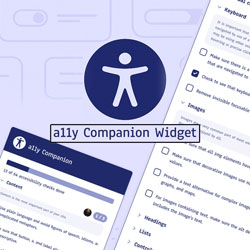

# ♿️ A11Y Companion – Accessibility Checklist Widget for Figma Design and FigJam

Built and maintained by Mark Learst.

| Project Health | Status |
| --- | --- |
| License |  |
| Latest release |  |
| Last commit |  |
| Commit activity |  |
| Open issues |  |
| Closed issues |  |
| Contributors |  |
| Platform |  |
| Tooling |  |

A production Figma widget that brings the [A11Y Project Checklist](https://www.a11yproject.com/checklist/) directly into your design workflow. Use this widget to check your designs, content, and code for accessibility and WCAG compliance with your team.

[a11y Companion Widget | Figma Community](https://www.figma.com/community/widget/1509302611418259130)

## ❓ What is this?

**A11Y Companion** is a Figma widget that helps you:

- Review and check off accessibility requirements for your project
- Track progress on WCAG compliance
- Collaborate with your team using avatars and real-time updates
- Get actionable, section-based checklist items with clear explanations and WCAG references

Based on the authoritative [A11Y Project Checklist](https://www.a11yproject.com/checklist/), this widget is designed for designers, content creators, and developers who want to make their work more accessible.

## ✨ Features

### Core

- Full A11Y Project checklist, organized by section
- Per-section and overall progress tracking
- WCAG references and detailed guidance per checklist item
- Search and filter across checklist text and WCAG codes
- Bulk section actions (check all / uncheck all)
- Section collapse/expand for faster navigation
- Markdown export with real task-list syntax (`- [ ]`, `- [x]`)
- WCAG Level Coverage summary in markdown export (`A`, `AA`, `AAA`)
- Works in both Figma Design and FigJam

### New in v2.0.0

- **Phase 1 - Foundation**
  - Variable-first design-system guardrails and baseline checks
  - WCAG contrast automation scripts and watch modes for fast/strict validation
  - WCAG level map generation and validation tooling
- **Phase 2 - Contrast Hardening**
  - Runtime contrast-safe accent resolution for themed UI states
  - Stronger AA/AAA reliability checks in scripts and hardening tests
- **Phase 3 - Deprecation Cleanup**
  - Canonical variable imports and removal of legacy alias usage across runtime modules
  - Cleaner design-system exports and fewer compatibility shims
- **Phase 4 - Widget UX Upgrades**
  - Contrast Inspector with on-canvas preview and property-menu toggle
  - Contrast status output for `AAA`, `AA`, `A` (large text only), and `Failed`
  - Gradient-aware contrast checks with sampled-min reporting
  - Clear unsupported-state messaging (image, mixed fills, dual gradients, stale selection)
  - AvatarStack activity tracking from real check/uncheck interactions
  - Improved avatar overflow handling with `+N` summary and readable tooltip names
  - Theme selection simplified to explicit `light` / `dark`

## ▶️ How to Use

1. **Install the widget** in your Figma or FigJam file.
2. Open the widget and review the checklist items by section.
3. **Search** for specific items using the search bar at the top.
4. Check off items as you complete them; your team can see your progress in real time.
5. Use **bulk actions** (☐/✓) next to section titles to mark all items complete/incomplete.
6. Click the **collapse/expand** button (▲/▼) to quickly navigate sections.
7. Hover over checklist items for WCAG references and detailed explanations.
8. Use the **property menu** to:
   - Change language (English/Español)
   - Change checklist template
   - Switch between light/dark themes
   - Switch accent color themes (Default, Indigo, Emerald, Rose, Slate, Cyan)
   - Toggle Contrast Inspector
   - Export checklist progress to Markdown

## 🔬 Contrast Inspector

1. Enable **Contrast Inspector** from the property menu.
2. Select a layer on canvas.
3. Press **Check** in the inspector row.
4. Review:
   - preview sample
   - ratio and grade
   - foreground/background metadata
5. Use **Swap** to preview reversed foreground/background contrast where supported.
6. Use **Clear** to reset the current inspector result.

The inspector supports solid and single-gradient scenarios. Unsupported combinations are reported with explicit status messages.

## ⚠️ Distribution Guardrails

This repository exists to maintain the official A11Y Companion widget.
Do not publish forks, clones, or modified builds to Figma Community.
Use the official listing linked above.
If you need changes, please open an issue.

## 🔒 Internal Maintenance Checks (Official Listing)

Checks used for maintaining the official repository and release workflow:

- `pnpm run build` - bundle widget code to `dist/code.js`
- `pnpm run watch` - rebuild on file changes
- `pnpm run lint` - ESLint plus design-system architecture checks
- `pnpm run tsc` - TypeScript checks (`--noEmit`)
- `pnpm run check:contrast` - AA contrast checks for theme combinations
- `pnpm run check:contrast:suggest` - nearest safe shade-step suggestions
- `pnpm run theme:baseline:check` - compare theme output to baseline snapshot
- `pnpm run test:hardening` - hardening regressions for shared/widget behavior

## 🗺️ Roadmap

Public roadmap updates are published with release notes in [`CHANGELOG.md`](CHANGELOG.md).

## 🐞 Report Issues

Found a bug or regression? Open an issue here:

- [GitHub Issues](https://github.com/marklearst/a11y-companion-widget/issues)

Please include:

- Figma or FigJam context
- Steps to reproduce
- Expected vs actual behavior
- Screenshots (if UI-related)
- Environment details (OS/Figma desktop version)

## 🔐 Security

For security-related reports, use the repository security policy:

- [Security Policy](.github/SECURITY.md)

## 🧭 Support and Project Notes

- [Support](.github/SUPPORT.md)
- [Third-Party Notices](THIRD_PARTY_NOTICES.md)
- [Official Listing Policy](.github/OFFICIAL_LISTING_POLICY.md)

This repository is maintained for the official widget release.
Use only the official listing/repository for the safest and most up-to-date version. Unofficial copies may include unreviewed changes, security issues, or regressions and are not supported by this project.
Please do not republish this widget under a different name or listing in Figma Community.

## 🤔 Why use this widget?

- Ensure your designs and content meet accessibility standards
- Make accessibility a collaborative, visible part of your workflow
- Reference the latest accessibility guidance from trusted sources

## 🙌 Credits

- Checklist data and guidance from [The A11Y Project](https://www.a11yproject.com/checklist/)
- Widget built with the [Figma Widget API](https://www.figma.com/widget-docs/api/api-reference/)

## 🚀 Make Accessibility First-Class

**Make accessibility a first-class part of your design and development process!**

## 📝 License

This project is licensed under the [Apache License 2.0](LICENSE).
© 2025–2026 Mark Learst
